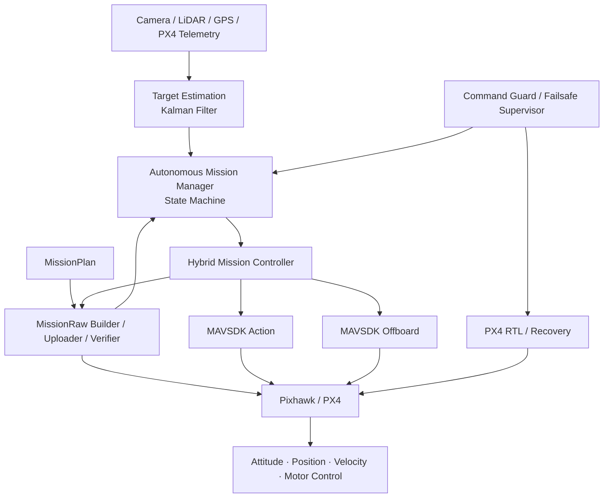

# VTOL Autonomy Lab

[](https://www.python.org/)
[](https://www.microsoft.com/windows)
[](https://px4.io/)
[](https://mavsdk.mavlink.io/)
[](LICENSE)

**컴패니언 컴퓨터 기반 PX4 VTOL 하이브리드 자율임무 프레임워크**

MissionRaw, MAVSDK Action, Offboard 제어, 상태머신, 고장 감지, 임무 무결성 검증, 가상 비행제어기와 표적 위치추정을 하나의 구조로 통합하는 연구·개발 프로젝트입니다.

> [!WARNING]
> 이 저장소는 연구·시뮬레이션 및 소프트웨어 검증 목적입니다. 실제 기체 시험 전에는 프로펠러를 제거하고, Arm·이륙·천이·Offboard 명령을 단계별로 검증해야 합니다. 현재 코드는 실제 비행 안전을 보증하지 않습니다.

---

## 1. 프로젝트 목표

이 프로젝트는 역할을 다음과 같이 분리합니다.

- **컴패니언 컴퓨터**: 임무 생성, 상태 판단, 표적 추정, 제어 모드 선택, 고장 대응
- **Pixhawk/PX4**: 자세·위치·속도 제어, VTOL 제어, 모터 출력, 비상 복귀
- **MissionRaw**: 장거리 웨이포인트 임무와 PX4 임무 저장소 통신
- **Offboard**: 표적 접근·정렬 등 단거리 정밀제어
- **RTL**: 상위 임무 소프트웨어 이상 시 PX4 독립 복구 경로

핵심 방향은 단순한 명령 전송 프로그램이 아니라, **비행 상황에 따라 MissionRaw·Offboard·RTL을 선택하는 상위 자율임무 컴퓨터**를 만드는 것입니다.

---

## 2. 핵심 기능

### 임무 관리

- JSON 기반 웨이포인트 임무계획
- 위도·경도·고도·도달 반경 검증
- MissionRaw 항목 생성
- FC 임무 업로드·일시정지·삭제·진행률 수신
- FC 저장소 재다운로드와 원본 임무 필드 대조
- 좌표 기반 가상 항법과 임무 진행률 계산

### 자율제어

- 상태머신 기반 임무 전환
- 가상 FC와 MAVSDK FC의 공통 인터페이스
- MissionRaw → VTOL 역천이 → Offboard → RTL 하이브리드 흐름
- 표적 상대 위치 기반 속도 Setpoint 생성
- Offboard 진입 전 초기 Setpoint 및 안전조건 검사

### 안전·검증

- 저전압, GPS 손실, 링크 손실, 고도·속도 제한 감시
- 천이 제한시간 초과 및 접근 중 추적 손실 처리
- Command Guard와 Failsafe Supervisor
- 기체가 Armed 또는 In-Air 상태일 때 안전 검증 CLI의 임무 쓰기 차단
- 상태 전환 및 텔레메트리 CSV 기록
- 100개 이상의 자동화 테스트와 고장 주입 시나리오

### 표적 위치추정

- 북·동 상대좌표의 2차원 등속도 칼만필터
- 위치와 이동속도 추정
- 측정 신뢰도 검사
- 혁신값 기반 이상치 제거
- 짧은 탐지 누락 중 예측 유지
- 공분산과 데이터 수명을 이용한 Offboard 접근 허용 판정

---

## 3. 시스템 구조



### 제어 수단별 역할

| 제어 수단 | 담당 범위 |
|---|---|
| MissionRaw | 장거리 이동, 탐색구역 진입, 복귀 경로, FC 임무 저장 |
| MAVSDK Action | Arm, Takeoff, Land, VTOL 천이·역천이 |
| Offboard | 표적 접근, 속도 보정, 정렬, 정밀 위치제어 |
| PX4 RTL | 통신·추적·Offboard·상위 임무 실패 시 안전 복귀 |

자세한 내용은 [아키텍처 문서](docs/ARCHITECTURE.md)를 참고하세요.

---

## 4. 프로젝트 구조

```text
vtol-autonomy-lab/
├─ config/
│  └─ mission.json
├─ src/
│  ├─ mission_context.py
│  ├─ state_machine.py
│  ├─ mission_manager.py
│  ├─ mission_plan.py
│  ├─ event_logger.py
│  ├─ flight_controller.py
│  ├─ virtual_fc.py
│  ├─ mavsdk_fc.py
│  ├─ failsafe_supervisor.py
│  ├─ mission_raw_builder.py
│  ├─ mission_raw_uploader.py
│  ├─ mission_raw_verifier.py
│  ├─ fc_validation_cli.py
│  ├─ target_estimate.py
│  ├─ target_filter.py
│  ├─ noisy_target_simulator.py
│  ├─ filtered_target_pipeline.py
│  ├─ command_guard.py
│  ├─ offboard_controller.py
│  └─ hybrid_mission_controller.py
├─ tests/
├─ docs/
├─ logs/
├─ requirements.txt
├─ CONTRIBUTING.md
├─ CHANGELOG.md
├─ CITATION.cff
└─ README.md
```

실제 파일 구성은 개발 단계에 따라 달라질 수 있습니다.

---

## 5. 설치

### 요구 환경

- Windows 10/11
- Python 3.11
- Git
- 실제 FC 검증 시 Pixhawk/PX4 및 데이터 통신 케이블

### 가상환경 생성

Windows CMD:

```cmd
cd /d C:\dev\vtol-autonomy-lab
python -m venv .venv
call .venv\Scripts\activate.bat
python -m pip install --upgrade pip
pip install -r requirements.txt
```

---

## 6. 자동시험

```cmd
python -m pytest -v
```

테스트 수집만 확인:

```cmd
python -m pytest --collect-only -q
```

테스트는 다음 범위를 포함합니다.

- 상태머신 정상·실패 전환
- 가상 FC와 MAVSDK 어댑터
- 웨이포인트 계획과 항법
- MissionRaw 생성·업로드·진행률·재다운로드 검증
- Failsafe와 Command Guard
- MissionRaw–Offboard 하이브리드 전환
- 표적 노이즈·누락·이상치
- 칼만필터 위치·속도 추정

자세한 내용은 [테스트 문서](docs/TESTING.md)를 참고하세요.

---

## 7. 실행 예시

### 정상 가상임무

```cmd
python -m src.mission_manager --backend virtual --scenario normal --mission-file config\mission.json
```

예상 종료 상태:

```text
최종 상태: COMPLETE
실패 코드: NONE
```

### 고장 주입

```cmd
python -m src.mission_manager --backend virtual --scenario low_battery
python -m src.mission_manager --backend virtual --scenario gps_loss
python -m src.mission_manager --backend virtual --scenario altitude_limit
python -m src.mission_manager --backend virtual --scenario airspeed_limit
```

### 하이브리드 임무 데모

```cmd
python -m src.mission_manager --hybrid-demo --hybrid-scenario normal
```

고장 시나리오:

```cmd
python -m src.mission_manager --hybrid-demo --hybrid-scenario low_confidence
python -m src.mission_manager --hybrid-demo --hybrid-scenario tracking_loss
python -m src.mission_manager --hybrid-demo --hybrid-scenario failsafe_during_approach
python -m src.mission_manager --hybrid-demo --hybrid-scenario transition_timeout
```

### Pixhawk 안전 연결 검증

먼저 장치 관리자에서 COM 포트를 확인합니다. 아래 예시는 COM5입니다.

읽기·대조 전용:

```cmd
python -m src.fc_validation_cli ^
  --connection-url serial://COM5:57600 ^
  --mission-file config\mission.json
```

Disarmed 및 지상 상태를 확인한 뒤 업로드·재다운로드 검증:

```cmd
python -m src.fc_validation_cli ^
  --connection-url serial://COM5:57600 ^
  --mission-file config\mission.json ^
  --upload
```

이 검증 CLI는 Arm·이륙·임무 시작·VTOL 천이 명령을 실행하지 않습니다.

---

## 8. 개발 상태

| 영역 | 상태 |
|---|---|
| 상태머신·가상 FC | 구현 |
| 웨이포인트 항법 | 구현 |
| MissionRaw 생성·업로드·검증 | 구현 |
| Failsafe·Command Guard | 구현 |
| MAVSDK FC 어댑터 | 구현 |
| MissionRaw–Offboard 하이브리드 제어 | 통합 시뮬레이션 단계 |
| 칼만필터 표적 위치추정 | 독립 모듈 및 자동시험 구현 |
| 실제 카메라 탐지 | 예정 |
| 실제 Pixhawk Offboard 실증 | 예정 |
| 정밀착륙 | 예정 |
| 임무장치 통합 | 예정 |

상세 진행상황은 [개발 상태](docs/DEVELOPMENT_STATUS.md)와 [로드맵](docs/ROADMAP.md)을 참고하세요.

---

## 9. 안전 원칙

1. 실제 시험 전 프로펠러를 제거합니다.
2. 연결·텔레메트리·MissionRaw 저장 검증부터 수행합니다.
3. Arm, Takeoff, Transition, Offboard는 각각 독립 검증합니다.
4. Offboard 시작 전 초기 Setpoint와 복구 모드를 설정합니다.
5. RC 조종자, 비상 정지 수단, 충분한 안전구역을 확보합니다.
6. 공공장소 또는 승인되지 않은 공간에서 시험하지 않습니다.
7. 비행 관련 법령과 운용기관 절차를 준수합니다.

전체 내용은 [안전 문서](docs/SAFETY.md)를 확인하세요.

---

## 10. 문서

- [아키텍처](docs/ARCHITECTURE.md)
- [설계 근거](docs/DESIGN_RATIONALE.md)
- [테스트](docs/TESTING.md)
- [안전](docs/SAFETY.md)
- [개발 상태](docs/DEVELOPMENT_STATUS.md)
- [로드맵](docs/ROADMAP.md)
- [GitHub 공개 체크리스트](docs/RELEASE_CHECKLIST.md)
- [기여 안내](CONTRIBUTING.md)
- [변경 이력](CHANGELOG.md)

---

## 11. 기술 참고자료

- [MAVSDK](https://mavsdk.mavlink.io/)
- [MAVSDK Mission Guide](https://mavsdk.mavlink.io/main/en/cpp/guide/missions.html)
- [MAVSDK Offboard Guide](https://mavsdk.mavlink.io/main/en/cpp/guide/offboard.html)
- [MAVSDK MissionRaw MissionItem](https://mavsdk.mavlink.io/main/en/cpp/api_reference/structmavsdk_1_1_mission_raw_1_1_mission_item.html)
- [MAVLink Mission Protocol](https://mavlink.io/en/services/mission.html)
- [MAVLink Common Messages](https://mavlink.io/en/messages/common.html)
- [PX4 Offboard Mode](https://docs.px4.io/main/en/flight_modes/offboard)
- [PX4 VTOL Mission Mode](https://docs.px4.io/main/en/flight_modes_vtol/mission)
- [PX4 Safety Configuration](https://docs.px4.io/main/en/config/safety)

---

## 12. 라이선스

이 프로젝트는 [MIT License](LICENSE)를 따릅니다.

## 13. 작성자

- GitHub: [gxmzung](https://github.com/gxmzung)
