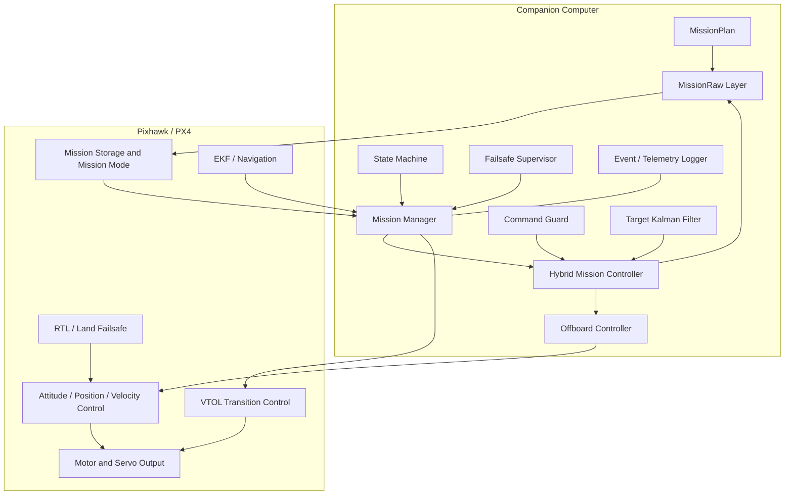
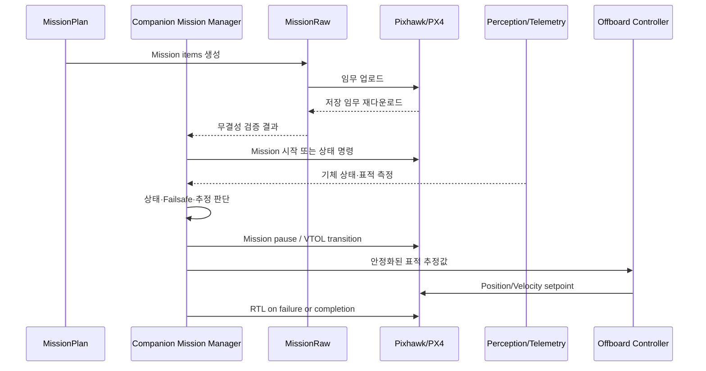

# 시스템 아키텍처

## 1. 설계 목표

VTOL Autonomy Lab은 컴패니언 컴퓨터와 Pixhawk/PX4의 역할을 분리한다.

- 컴패니언 컴퓨터는 임무 판단과 상위 자율성을 담당한다.
- PX4는 비행 안정화와 저수준 제어를 담당한다.
- 상위 소프트웨어가 실패해도 PX4가 독립적으로 안전 복구할 수 있어야 한다.
- 실제 기체가 없어도 Virtual FC와 Fake MAVSDK 객체로 핵심 로직을 검증할 수 있어야 한다.

## 2. 계층 구조



## 3. 핵심 모듈

### MissionPlan

JSON 임무 파일을 내부 도메인 객체로 변환한다.

검증 항목:

- 임무 이름
- 웨이포인트 수
- 위도·경도 범위
- 상대고도
- 도달 반경
- 웨이포인트 이름 중복

### State Machine

임무의 명시적 상태와 전환 조건을 관리한다.

대표 흐름:

```text
IDLE
→ PREFLIGHT
→ ARMING
→ TAKEOFF
→ HOVER
→ FORWARD_TRANSITION
→ CRUISE
→ TARGET_SEARCH
→ BACK_TRANSITION
→ RETURN_HOME
→ LAND
→ COMPLETE
```

하이브리드 흐름에서는 MissionRaw 순항 이후 표적 접근을 위해 Offboard 제어가 삽입된다.

### FlightControllerInterface

상위 임무 로직이 실제 MAVSDK와 가상 FC에 의존하지 않도록 공통 인터페이스를 제공한다.

구현체:

- `VirtualFlightController`
- `MavsdkFlightController`

### MissionRaw 계층

```text
MissionPlan
→ MissionRawBuilder
→ MissionRawUploader
→ PX4 Mission Storage
→ MissionRaw Download
→ MissionRawVerifier
```

원본과 다운로드 임무의 다음 필드를 비교한다.

- seq
- frame
- command
- current
- autocontinue
- param1~4
- x
- y
- z
- mission_type

### Hybrid Mission Controller

MissionRaw, MAVSDK Action, Offboard, RTL의 역할을 분리한다.

```text
MissionRaw 장거리 비행
→ 임무 일시정지
→ VTOL 멀티콥터 역천이
→ 초기 Offboard Setpoint
→ Offboard 시작
→ 표적 접근·정렬
→ Offboard 종료
→ RTL 또는 복귀 임무
```

### Target Filter

2차원 등속도 칼만필터로 표적의 북·동 위치와 속도를 추정한다.

입력:

- timestamp
- north/east 상대좌표
- 탐지 신뢰도
- 측정 유효성

출력:

- 필터링 위치
- 추정 속도
- 위치 표준편차
- 필터 신뢰도
- 추적 안정 여부
- 오래된 데이터 여부
- 이상치 수용 여부

## 4. 제어권 분리

| 제어 계층 | 사용 조건 | 장점 | 복구 |
|---|---|---|---|
| MissionRaw | 사전 정의 장거리 경로 | PX4 내부 실행, 링크 단절 내성 | Pause, RTL |
| Action | 이륙·착륙·천이 | 명시적 고수준 명령 | 오류 감지 후 RTL |
| Offboard | 표적 접근·정렬 | 컴패니언 기반 실시간 보정 | Hold, RTL |
| RTL | 고장 또는 임무 중단 | PX4 독립 복구 | Land |

## 5. 데이터 흐름



## 6. 실패 격리

- MissionRaw 생성 실패는 FC 통신 전에 차단한다.
- 다운로드 검증 실패는 임무 실행 전에 차단한다.
- Armed 또는 In-Air 상태에서는 안전 검증 CLI의 쓰기를 차단한다.
- 표적 신뢰도·추적 안정성이 부족하면 Offboard 진입을 차단한다.
- Offboard 접근 중 추적 손실·Failsafe 발생 시 RTL로 전환한다.
- 선택적 텔레메트리 스트림의 오류와 전체 연결 실패를 구분해야 한다.
